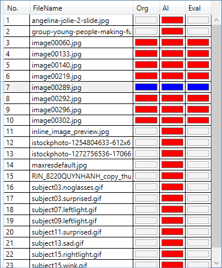

# Face3DReconstruction
A WPF application for displaying 3D face mesh results which are restored from 2D images.  
This application is built following Model–view–viewmodel (MVVM) architectural pattern and use HTTP request for getting 3D mesh from server.  
Server for HTTP request is needed to started when using this application.  
Implementation for HTTP server is a python application in file *load_model_server.py* of repo [PRNet-keras](https://github.com/kameo4189/PRNet-keras).  

****

## Contents

* [Requirements](#Requirements)
* [Usage](#Usage)
* [References](#References)

## Requirements
You need to install .Net Framework 4.6.1 or above to run this application.

## Usage

### Start server
Do **Installation** part in git repo [PRNet-keras](https://github.com/kameo4189/PRNet-keras).  
Run file *load_model_server.py* for getting server url from terminal.  
For example, local url and internet url are outputed at below:  
  *Public URL: NgrokTunnel: "https://1f5e-14-161-7-170.ngrok.io" -> "http://localhost:20000"*    

## Start application
You can build application by using Visual Studio 2019 or get from Release of this repo.  
Run file Face3DReconstruction.exe for stating application.  

### Overview
Overview GUI of application  
* Info Input: area for 2 texboxes on the top is used for inputting folder path and server url
* Image List: area for list view on the center right is used for displaying list of images
* Logging List: area for list view on the bottom right is used for displaying errors and status log
* Tab View: area for tab view on the center is used for displaying images and result meshs
* Mesh List: area for list view on the bottom center is used for displaying list of result meshs
* Evaluation List: area for list view on the bottom right is used for displaying list of evaluation results
  
All viewports for 2D image and 3D mesh on GUI can be zoomed and moved by mouse.  
With 2D image viewports, you can click right mouse for reset to default view and press Ctrl-S for saving current image.
With 3D image viewports, you can press Ctrl-K for display Keypoint and Ctrl-R for reset to default view.  

#### Info Input Area
Info Input area is used for inputting server url and folder path that contains images used for processing.

After inputting folder path, Image List area will be displayed percentage of listing processing as below  

#### Image List Area
Image List area is used for displaying image list that is used for requesting mesh.
After finished listing processing, image list will be displayed as below  

Details of columns in Image List area:
* Column 1: numerical order of each
* Column 2: name of image
* Column 3: button for requesting original mesh, it will be enabled when existing mat file with same name at the same folder of current image.
* Column 4: button for requesting AI mesh
* Column 5: button for requesting evaluation result, it will be enabled when existing mat file with same name at the same folder of current image.
Buttons in column 3, 4, 5 will change color following processing status:
* Red: not request yet.
* Green: sent request and waiting for response.
* Blue: received response and finsished display result.
When selecting multiple images and click a button, all selected images will be processed for sending request.  
When clicking on an image item, current selected image and result mesh will be displayed on Tab View area and Mesh List area.

#### Tab View, Mesh List and Evaluation List Area
After selecting an item on Image List area, image and mesh (if requested) will be displayed.  
Mesh List area will also display the AI mesh list. When selecting an item on Mesh List area, Evaluation List area will display the evaluation result of current AI mesh.  
* The Preview tab will display current selected image, original mesh and AI mesh, 2D aligment of mesh of selected image will be also displayed.  

When selecting an an item on Mesh List area, current selected mesh will be highlighted on all tabs. 

* The Original image tab: display image with 2D alignment of original mesh

* The Original mesh tab: display original mesh

* The AI image tab: display image with 2D alignment of AI mesh

* The AI mesh tab: display AI mesh

